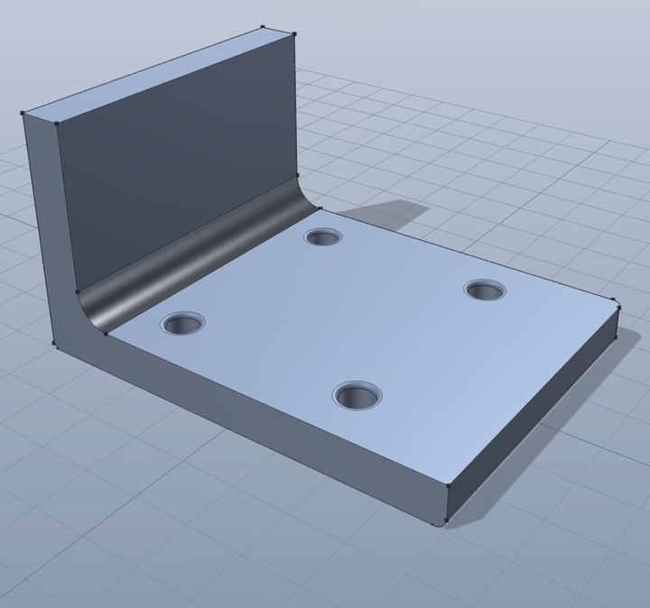
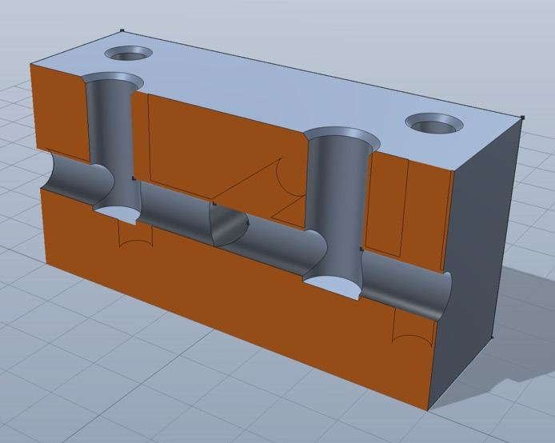

# ParCAD

Parametric CAD you write as code — for people, and for agents.

**Status: 0.0.1, experimental.** One author, and the DSL still moves. Every
operation is checked against measured geometry ([eval/cases/](eval/cases/)), but
none of it has had the years of abuse that make a CAD kernel trustworthy.
Measure a part before you machine it.



```js
const plate = box(80, 60, 8).tag("plate");
const wall = box(8, 60, 40).at(-36, 0, 20).tag("wall");

const body = union(plate, wall, { blend: 6 });          // the blend is the fillet
const drilled = body.cut(...grid(2, 2, 36, 40).map(([x, y]) => cylinder(3, 32).at(x, y)));

return drilled
  .edges({ curve: "circle", role: "hole", adjacentTo: { faceNormal: "+z" } })
  .expect({ count: 4 })                                  // a build error, not a surprise
  .fillet(0.8);
```

You never name an edge by index. You describe it — *the circular rims that open
onto the top face* — and the description still works after you move a hole.

## Two kernels, one model

Your script builds a small JSON graph, and two kernels read it: an implicit one
(signed distance fields, instant) and an exact one (OpenCASCADE — real faces,
edges, STEP export). Neither is a fallback for the other, and the graph is what
keeps today's script working after tomorrow's kernel swap.



Parts get measured, not assumed — volume, wall thickness, whether two bores
actually meet. An agent gets the same numbers over MCP, with no screen to look at.

It is aimed at small mechanical parts — brackets, flanges, manifolds, heat sinks,
the things you print or machine one of. [examples/](examples/) is twenty-two.

## Why not CadQuery, build123d or OpenSCAD

Those are good, and much older. Three differences. Selectors are *descriptive and
checked* — `.expect({ count: 4 })` turns a selector that silently started
matching three edges into a build error, which is the failure mode that makes
code-CAD fragile. Two kernels read one graph, so the instant preview and the
exact B-rep behind STEP export are one model, not two projects. And measurement
is an output rather than something you eyeball, which is what makes the MCP
surface real instead of a wrapper.

## Install it

Download the zip from [Releases](https://github.com/ierehon1905/parcad/releases),
unzip, drag it to Applications. Or with Homebrew:

```bash
brew tap ierehon1905/parcad
brew trust ierehon1905/parcad
brew install --cask parcad
```

**Either way, macOS will refuse to open it the first time.** The builds are not
signed with an Apple Developer ID or notarised, and Homebrew quarantines what it
installs like a browser does. Clear the flag once:

```bash
xattr -dr com.apple.quarantine /Applications/ParCAD.app
```

Apple silicon only for now.

## Build it

macOS. On Linux, CI builds the kernel crates on every push, but nobody has built
the OCCT worker or the window there — patches welcome. Windows is unsupported:
the worker's process handling has no Windows arm.

You need [Rust](https://rustup.rs/) (the toolchain is pinned; rustup honours it),
[Bun](https://bun.sh/), CMake, a C++ compiler, `patch(1)` and Python 3.11+. A
clone is a 28 MB pack that expands to 144 MB, most of it a vendored OpenCASCADE
tree, and a full build wants around 20 GB free.

```bash
cd app && bun install --frozen-lockfile && cd ..   # first: the Rust build shells out to bun
cargo build --locked --release
tools/build-worker.sh     # the exact kernel — ~5 min on 14 cores, once
cd app && bun run tauri dev
```

`cargo build` produces a *dev* app whatever the profile — Tauri's switch is the
`custom-protocol` feature, not `--release` — so launch the window through `tauri
dev` or `tauri build`, never the bare binary. And a root `cargo build`
deliberately does not build OpenCASCADE; `tools/build-worker.sh` does.

```bash
tools/check.sh            # everything that gates a change (~5 min)
tools/check.sh --fast     # the kernel crates and the editor tests (~4 s)
```

Or headless:

```bash
bun tools/run.ts examples/bracket.js > /tmp/bracket.json
./target/release/parcad /tmp/bracket.json --out out --brep --step out/part.step
```

The app serves its UI and an MCP endpoint on <http://127.0.0.1:4242>. Parts live
in `~/Documents/parcad` as plain `.js` files you can edit anywhere.

```bash
claude mcp add --transport http parcad http://127.0.0.1:4242/mcp
```

Point an agent at it and start with the `read_docs` tool — it hands over the
whole language in one call.

## More

- [examples/](examples/) — twenty-two parts, from a bracket to a hydraulic manifold
- [CONTRIBUTING.md](CONTRIBUTING.md) — the gate, and what a change has to satisfy
- [docs/ARCHITECTURE.md](docs/ARCHITECTURE.md) — how the pieces fit, and why
- [docs/GOTCHAS.md](docs/GOTCHAS.md) — traps that have already cost a day each
- [docs/NEXT.md](docs/NEXT.md) — what's missing, in order

## Licensing

MIT or Apache-2.0, at your option. Built on components that are not: OpenCASCADE
and its bindings under `vendor/` are LGPL-2.1, and the implicit kernel
[fidget](https://github.com/mkeeter/fidget) is MPL-2.0. Building from source is
unencumbered; **redistributing a binary carries obligations** —
[NOTICE.md](NOTICE.md) spells them out, including how to swap in your own
OpenCASCADE.

This software makes use of facilities provided by the Open CASCADE Technology
software.
