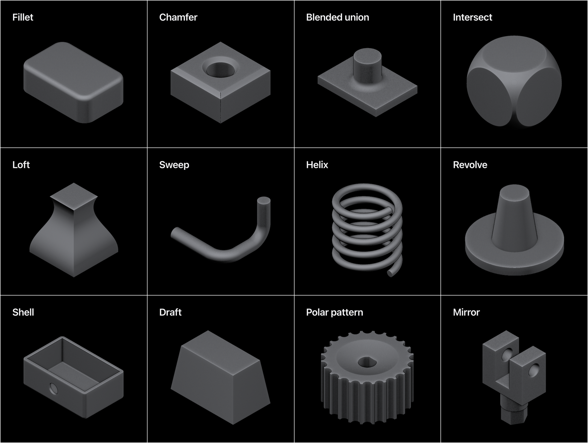
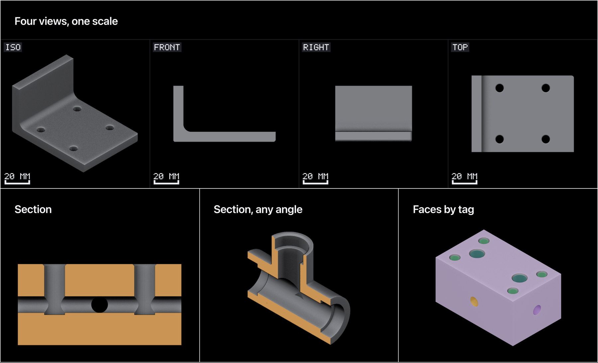

# ParCAD

Parametric CAD you write as code — for people, and for agents.

**Status: 0.0.7, experimental.** One author, and the DSL still moves. Every
operation is checked against measured geometry ([eval/cases/](eval/cases/)), but
none of it has had the years of abuse that make a CAD kernel trustworthy.
Measure a part before you machine it.


```js
const plate = box(80, 60, 8).tag("plate");
const wall = box(8, 60, 40).at(-36, 0, 20).tag("wall");

const body = union(plate, wall, { blend: 6 });          // the blend is the fillet
const drilled = body.cut(...grid(2, 2, 36, 40).map(([x, y]) => cylinder(3, 32).at(x, y)));

return drilled
  .edges({ curve: "circle", role: "hole", adjacentTo: { faceNormal: "+z" } })
  .expect({ count: 4 })                                  // a build error, not a surprise
  .fillet(0.8);
```

You never name an edge by index. You describe it — *the circular rims that open
onto the top face* — and the description still works after you move a hole.



## One graph, one exact kernel

Your script builds a small JSON graph, and an exact kernel reads it —
OpenCASCADE: real faces and edges, STEP export, and a refusal rather than an
approximation when it cannot do something faithfully. The graph is what keeps
today's script working after tomorrow's kernel swap.


Parts get measured, not assumed — volume, wall thickness, whether two bores
actually meet. An agent gets the same numbers over MCP, with no screen to look at.

And when it does look, it gets pictures made for reading: views that share one
scale, sections through the inside, and every surface coloured by the tag that
built it.



It is aimed at small mechanical parts — brackets, flanges, manifolds, heat sinks,
the things you print or machine one of. [examples/](examples/) is twenty-two.

## Why not CadQuery, build123d or OpenSCAD

Those are good, and much older. Three differences. Selectors are *descriptive and
checked* — `.expect({ count: 4 })` turns a selector that silently started
matching three edges into a build error, which is the failure mode that makes
code-CAD fragile. What you see, what you measure and what you export come off
one exact B-rep, so the preview and the STEP file are one model, not two
projects. And measurement is an output rather than something you eyeball,
which is what makes the MCP surface real instead of a wrapper.

## Install it

With Homebrew, on macOS or Linux (Linux from 0.0.6), which installs the host
and no window:

```bash
brew tap ierehon1905/parcad
brew trust ierehon1905/parcad
brew install parcad
```

Then [add it to your agent](#use-it-from-an-agent), which starts parcad when it
needs it. To use the app yourself, run `parcad serve` and open
<http://127.0.0.1:4242> — the whole app is there, in your browser.

On Windows, from 0.0.6, the desktop app through winget:

```powershell
winget install ParCAD.ParCAD
```

Nothing on the Homebrew path is quarantined. The same `parcad` is the headless driver
(`parcad part.js`), and a client of the running host: `parcad tools`
lists what an agent can call over MCP and `parcad call <tool>` calls it from
a shell.

Or the desktop app, from
[Releases](https://github.com/ierehon1905/parcad/releases):

| platform | download |
|---|---|
| macOS, Apple silicon | `ParCAD-aarch64-apple-darwin.zip` — unzip, drag to Applications |
| Linux x86_64 | `.deb` or `.AppImage` |
| Windows x86_64 | `.msi` or `-setup.exe` |

Each platform's build measures the whole eval corpus with the worker it ships
before it is uploaded. None of them is signed. **macOS will refuse to open the
app the first time**, and again after each update. Clear the flag:

```bash
xattr -dr com.apple.quarantine /Applications/ParCAD.app
```

Windows SmartScreen warns the same way: *More info*, then *Run anyway*. Every
platform also has a `parcad-cli-*` archive — `parcad`, its worker beside it and
the seed parts — for running the host without a window. Keep the two binaries
together.

## Build it

macOS, Linux and Windows. Day-to-day development is on macOS; the release
workflow builds and measures on all three, and Linux on arm64 builds too.

You need [Rust](https://rustup.rs/) (the toolchain is pinned; rustup honours it),
[Bun](https://bun.sh/), CMake, a C++ compiler, `patch(1)` and Python 3.11+. A
clone is a 28 MB pack that expands to 144 MB, most of it a vendored OpenCASCADE
tree, and a full build wants around 20 GB free. On Linux the window also needs
WebKitGTK (`libwebkit2gtk-4.1-dev`), and `libclang-dev` for the script sandbox's
bindings. On Windows, use MSVC (Visual Studio Build Tools) and run the scripts
from Git Bash, which also provides `patch`.

```bash
cd app && bun install --frozen-lockfile && cd ..   # first: the Rust build shells out to bun
cargo build --locked --release
tools/build-worker.sh --release   # the exact kernel — ~5 min on 14 cores, once
cd app && bun run tauri dev
```

`cargo build` produces a *dev* app whatever the profile — Tauri's switch is the
`custom-protocol` feature, not `--release` — so launch the window through `tauri
dev` or `tauri build`, never the bare binary. And a root `cargo build`
deliberately does not build OpenCASCADE; `tools/build-worker.sh` does.

```bash
tools/check.sh            # everything that gates a change (~5 min)
tools/check.sh --fast     # the kernel crates and the editor tests (~4 s)
```

Or headless:

```bash
bun tools/run.ts examples/bracket.js > /tmp/bracket.json
./target/release/parcad /tmp/bracket.json --out out --step out/part.step
```

The app serves its UI and an MCP endpoint on <http://127.0.0.1:4242>. Parts live
in `~/Library/Application Support/parcad` as plain `.js` files you can edit anywhere.

## Use it from an agent

With nothing installed: open [ParCAD web](https://ierehon1905.github.io/parcad/app/),
choose **Connect your AI**, and give your client the link it shows — Claude
Code, the Claude app as a custom connector, Cursor, VS Code, or any client that
connects to a URL. The tab is the server, with the same tools as the app, and it
has to stay open; a relay passes the messages and keeps none
([relay/README.md](relay/README.md)).

Every route below runs the same `parcad` on your machine: the one Homebrew
installs, which the desktop app carries too. Install either first.

As a plugin, which brings the MCP server and a skill that says how to use it:

```text
/plugin marketplace add ierehon1905/parcad
/plugin install parcad@parcad
```

In Codex, which finds `parcad` on PATH, so the Homebrew install:

```bash
codex plugin marketplace add ierehon1905/parcad
codex plugin add parcad@parcad
```

In Cursor or VS Code, with `parcad` on PATH:

[](https://cursor.com/install-mcp?name=parcad&config=eyJjb21tYW5kIjoicGFyY2FkIiwiYXJncyI6WyJtY3AiXX0%3D)
[](https://vscode.dev/redirect/mcp/install?name=parcad&config=%7B%22name%22%3A%22parcad%22%2C%22command%22%3A%22parcad%22%2C%22args%22%3A%5B%22mcp%22%5D%7D)

Or add the server by hand, in any client that launches stdio servers:

```bash
claude mcp add parcad -- parcad mcp
```

```bash
codex mcp add parcad -- parcad mcp
```

`parcad mcp` relays to the app or `parcad serve` when one is running, so the
agent shares the live session with your window. When none is running it hosts
one itself, for as long as the client stays connected. A client that connects
by URL can use `http://127.0.0.1:4242/mcp` directly, but only while a host is
up; `brew services start parcad` keeps one up from login.

The same tools are on the command line, with the same names and arguments —
`parcad tools` lists them, `parcad call evaluate_part --set script=@part.js`
calls one — and they work whether or not the app is open.

Start the agent on the `read_docs` tool, which hands over the whole language in
one call.

## More

- [examples/](examples/) — twenty-two parts, from a bracket to a hydraulic manifold
- [CONTRIBUTING.md](CONTRIBUTING.md) — the gate, and what a change has to satisfy
- [docs/ARCHITECTURE.md](docs/ARCHITECTURE.md) — how the pieces fit, and why
- [docs/GOTCHAS.md](docs/GOTCHAS.md) — traps that have already cost a day each
- [docs/NEXT.md](docs/NEXT.md) — what's missing, in order

## Licensing

MIT or Apache-2.0, at your option. Built on components that are not: OpenCASCADE
and its bindings under `vendor/` are LGPL-2.1, and one file of our own,
`crates/parcad-core/src/occlusion.rs`, is MPL-2.0 because it was ported from
[fidget](https://github.com/mkeeter/fidget). Building from source is
unencumbered; **redistributing a binary carries obligations** —
[NOTICE.md](NOTICE.md) spells them out, including how to swap in your own
OpenCASCADE.

This software makes use of facilities provided by the Open CASCADE Technology
software.
